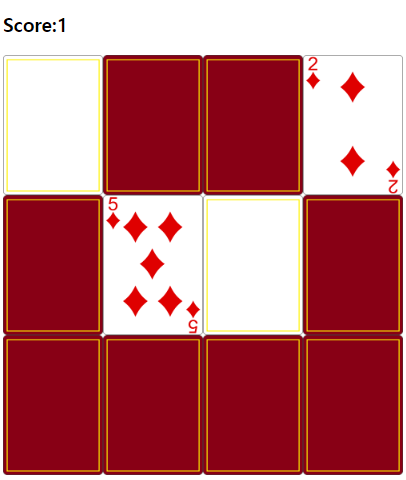

# Memory Game - JavaScript Project

## Overview
This project implements a classic Memory Game using HTML, CSS, and JavaScript. The goal is to match pairs of cards with identical images.

## Preview


## Features
- Randomized card placement for each game session.
- Score tracking to count successful matches.
- Responsive design with CSS grid layout.

## Project Structure
- **index.html**: Contains the game interface structure.
- **app.js**: Manages game logic including card flipping, matching, and score tracking.
- **style.css**: Defines visual styling for game elements.

## How to Play
1. Clone the repository.
2. Open `index.html` in your web browser.
3. Click on cards to reveal their images.
4. Match pairs of identical images to score points.
5. Win by matching all pairs.


## Installation
Clone the repository:
```bash
git clone https://github.com/your-username/memory-game.git
```

## Credits
- Developed by SALKOGI07

## License
This project is licensed under the MIT License.
